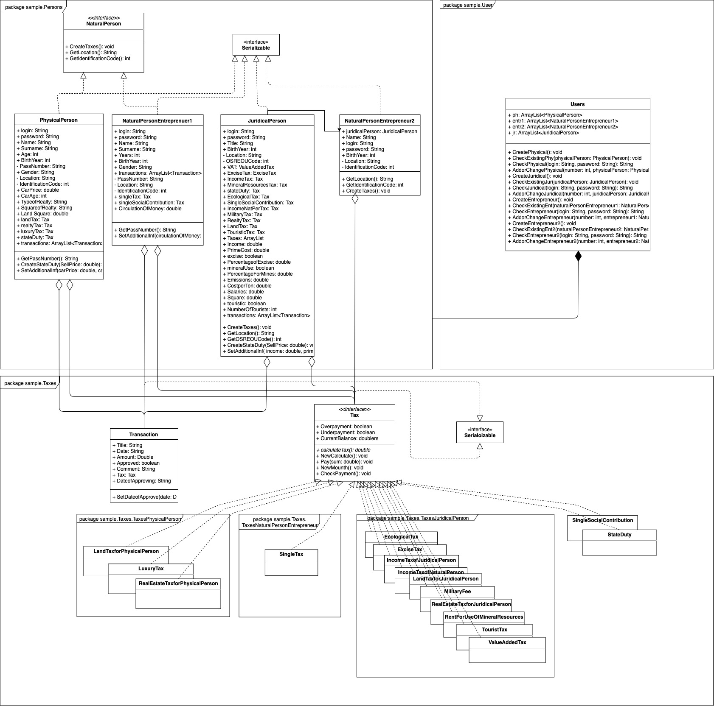

# About

It is a result of work at subject Object Oriented Programming (SS 2018/2019). The aim is to implement an application using OOP principles in Java. 

# Project Objective
«E-Taxpayer» is an application made for every person (Juridical, Physical...). It is adapted for each of taxpayers due to his/her functions and possibilities. «E-Taxpayer» is a very useful application, which helps you to regulate almost all your taxes just sitting at your computer. There is no more long queues and doubtful sums. It provides you a possibility to see all you taxes as a list, which is constructed especially for each natural person, natural person-entrepreneur and juridical person.

Firstly, you have to register yourself in the application. And to see all the stuff, you have to add some additional information about your job. The main functions, which help you not to lost in your calculation, are: all payments are listed and you can also see if there is any over-/underpayment on every tax. Also there is a possibility to add a single, not periodic action, which cause taxpaying (like selling car or realty). Moreover, you can construct different lists of taxes by their types (for example: ones which have under-/ overpayment, ones which should be paid every month). Also there may be a list with your payments in date order and a total sum paid to the country.

«E-Taxpayer» is an application which puts in order all your spendings as a ratepayer.

# Structure:

